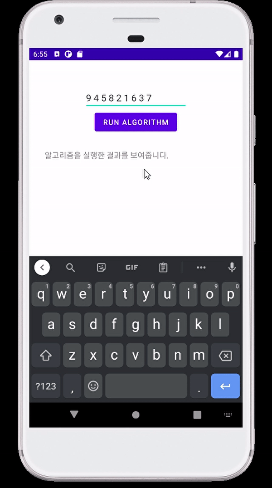

# Wafflestudio Android Seminar 0 - Assignment

## 과제 목표
- Android의 기본 동작 방식을 알고 앱을 생성하여 실행시켜 볼 수 있다. 
- Kotlin을 다루는 방법을 알고 이를 Android Source Code 내에서 작성해볼 수 있다.
- Intent를 활용한 Activity 전환을 이해한다.
- View의 작동방식을 알고 여러 View를 사용해본다.

## 과제 상세
- App은 다음과 같은 구조로 구현한다.
    1. MainActivity
        - 앱이 시작하는 화면
        - 두 개의 버튼으로 구성
        - 첫 번째 버튼은 IntroduceActivity로 이동
        - 두 번째 버튼은 KotlinPracticeActivity로 이동
    2. IntroduceActivity
        - 한 개의 ImageView와 한 개의 TextView로 구성
        - ImageView에는 자신을 드러내는 이미지 하나
        - TextView에는 이름, 학과, 학번 등 자신을 소개하는 텍스트로 구성
    3. KotlinPracticeActivity
        - 한 개의 EditText, 한 개의 Button, 한 개의 TextView로 구성
        - EditText로 임의의 개수의 정수가 띄어쓰기로 구분하여 작성
        - Button을 눌렀을 시 TextView에 EditText의 값을 다음을 적용시켜 개행문자로 구분하여 보여준다.
            1. 정수 list의 각 정수 뒤에 "명" 덧붙이기 (띄어쓰기로 구분)
            2. 정수 list의 각 수가 짝수 일때만 출력 (띄어쓰기로 구분)
            3. 정수 list의 오름차순 정렬 (띄어쓰기로 구분)
            

- 그 외 추가로 구현하고 싶으신게 있으시면 자유롭게 구현해주시면 됩니다!

## 과제 진행 방법
- 본인의 github에 "waffle-android-assign"이라는 이름으로 새로운 private repository를 생성한다.
- 만들었던 private repository를 자신의 컴퓨터에 clone 받는다.
- Android Studio를 통해 waffle-android-assign 폴더 안에 Assignment0 라는 이름의 프로젝트를 만든다.
- 과제를 완료한 후 `git add .`, `git commit`, `git push`를 통해 github에 업로드한다.

## 제출 방식
- 완성된 과제가 있는 private repository(waffle-android-assign)에서 `Settings > Manage access > Invite a collaborator` 로 들어가 [@veldic](https://github.com/veldic)을 초대한다.
