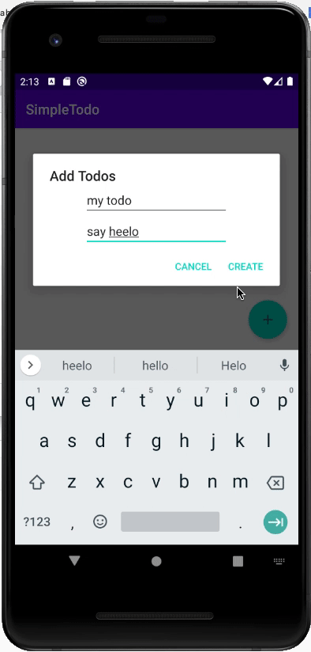

# Wafflestudio Android Seminar 2 - Assignment
#### due: 2021.09.26 18:00

## 과제 목표
- Room DB의 개념을 이해하고 사용할 수 있다.
    - ViewModel이 데이터를 영구적으로 저장할 수 없음을 이해하고 Room DB를 활용해 영구적인 정보 저장을 구현할 수 있다.
    - Database - Repository - ViewModel - View 로 이어지는 데이터의 흐름을 이해한다.
- RecyclerView의 개념을 이해하고 사용할 수 있다.
    - Adapter, ViewHolder의 역할을 알고 구현할 수 있다.

## 과제 상세
- SimpleTodo Application을 Android Application으로 구현한다. 
- 사용자는 floating button을 클릭하여 `title`과 `content`라는 두 문자열을 가진 새로운 `Todo`를 추가할 수 있다. (CREATE)
- `Todo`는 RecyclerView를 통해 구현한 UI 에 나타나야 한다 (READ)
- 사용자가 뷰의 Todo item의 DONE 버튼을 누를 시 해당 Todo item을 삭제한다. (DLELTE)
- 위 TODO 데이터는 안드로이드 로컬 데이터베이스에 저장하여 앱을 재시작하더라도 남아있어야 한다. (Android Room 을 통해 구현 가능)
  - 기본적인 Table(Entity)은 이미 뼈대 코드에 구현해 놓았다 (`Todo.kt`)
- 뼈대 코드의 경우 이 레포지토리의 Assignment2Skeleton 폴더에 제공된다.
- 뼈대 코드는 사용해도 좋고, 직접 a-z를 만들어 보아도 좋다.
- 과제의 채점은 pass / fail 로 구체적인 기준은 두지 않고, 앞서 언급된 Simple Todo Application의 명세를 만족하면 pass 이다.
  - 다만, Repository Pattern 과 Room Database 를 활용하여 완결성 있는 MVVM pattern의 앱을 작성해야 한다.
  - MVVM Pattern은 뼈대 코드에 이미 구현되어 있다.
  - 뼈대 코드를 사용할 경우 이미 구현된 MVVM Pattern 코드를 보고 데이터의 흐름을 이해한다.



### 중요 (suspend fun)
- suspend fun은 코루틴의 요소 중 하나로 async programming을 구현하기 위해 사용되었다. 이 내용은 다음 세미나에서 자세하게 다룰 것이나, Room에서 DB의 접근을 main thread에서 허용하지 않기 때문에 부득이하게 이번 과제에서 사용하게 되었다. 
- 사용 방법은 다음과 같다. 
    1. TodoDao.kt 에서 LiveData를 사용하지 않는 (즉, READ 작업이 아닌 경우) 함수에 대해 `suspend fun`으로 선언한다.
    ```
    @Query("SELECT ...")
    fun getSomething(): LiveData<...>  // suspend 필요 X

    @Insert
    suspend fun insertSomething(something: ...)  // suspend 필요 O
    ```

    2. Repository에서도 suspend fun으로 선언하여 ViewModel에서 사용할 수 있도록 한다.

    3. ViewModel에서 다음과 같이 선언하여 일반 fun으로 바꿔준다.
    ```
    fun insertSomething(something: ...) {
        viewModelScope.launch {
            somethingRepository.insertSomething(something)
        }
    }
    ```
    ViewModel의 함수 내에서 `viewModelScope.launch` 로 Repository의 `suspend fun`을 감싸주면 된다.

    4. Activity에서 잘 사용한다.
    ```
    binding.someButton.setOnClickListener {
        viewModel.insertSomething(somethingData)
    }
    ```

## 제출 방식
- 본인의 github에 생성했던 `waffle-android-assign` repository를 그대로 사용한다. 
- 기존에 사용하던 깃의 `master branch`에서 `git checkout -b assignment2` 등으로 새로운 branch로 이동한다.
- 다음의 방식을 사용하여 과제를 진행한다.
    - Android Studio를 통해 `waffle-android-assign` 폴더 안에 Assignment2 라는 이름의 새로운 프로젝트를 만들어 진행한다.
    - `wafflestudio/19.5-rookies repo`를 clone한 뒤, `android/assignment_2/Assignment2Skeleton` 폴더를 복사하여 진행한다.
- 과제를 완료한 후 `git add .`, `git commit`, `git push origin assignment2`를 통해 github에 업로드한 뒤, main(master) branch로 Pull Request를 만든다.
- 생성된 Pull Request에 [@veldic](https://github.com/veldic)을 Reviewers로 등록한다.

```
waffle-android-assign
├── Assignment0
├── (Assignment1)  // 있어도 되고 없어도 됨
├── Assignment2
    ├── app
    .
    .
    .
```

위와 같은 폴더 구조가 만들어지면 된다.

- 마감 시점의 assignment2 branch를 기준으로 세미나장이 직접 확인할 것입니다.
