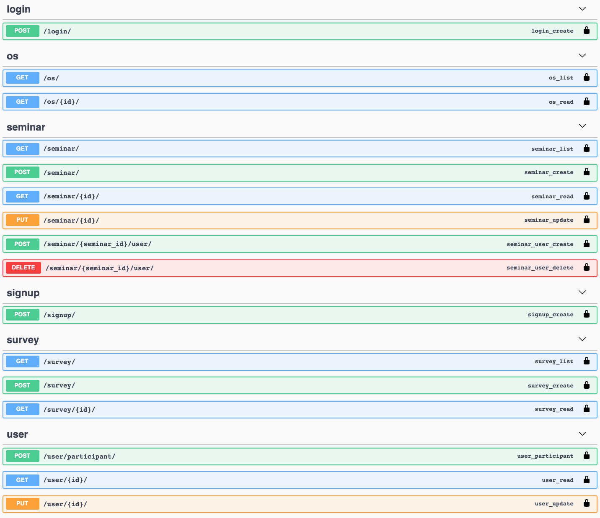

# Wafflestudio Android Seminar 4 - Assignment
#### due: TBD

## 과제 목표
- 뼈대 코드 없이 스크래치부터 새로운 앱을 만들어본다. 
- API 문서를 읽으며 백엔드 서버의 스펙을 확인하고 직접 기능을 구현해본다.
## 과제 상세
- 이번 과제는 백엔드 [assignment 0](../../django/seminar0/assignment0/README.md), [assignment 1](../../django/seminar1/assignment1/README.md), [assignment 2](../../django/seminar2/assignment2/README.md) 에서 명시된 api 서버를 활용해 세미나 참여자, 진행자를 관리하는 SeminarManager Application 을 제작하는 것입니다.
    - 유저의 회원 가입과 토큰을 persist 하게 저장하며 유저의 인증 정보를 앱에서 가지고 로그인 할 수 있어야 합니다.
    - 회원 가입된 유저는 유저의 role(instructor, participant) 에 따라 다른 행동을 할 수 있습니다.
        - instructor 는 세미나를 만들고 수정할 수 있습니다.
        - participant 는 세미나에 참여할 수 있습니다.
    - 유저의 개인 정보를 앱에서 변경 가능합니다.
- 이번 과제는 스켈레톤 코드가 주어지지 않습니다. 그만큼 원하는 기술 스택을 사용하여서 과제를 구현하시면 됩니다. (ViewModel이나 Observable Pattern 등을 사용하지 않아도 됩니다.)
- 백엔드 서버의 [api 문서](http://ec2-3-37-16-171.ap-northeast-2.compute.amazonaws.com/swagger/)를 통해 어떤 기능을 구현할 수 있는지 확인하고, 아래의 명시된 가이드를 참고하여 적절한 앱을 구현하시면 됩니다. 과제의 스펙이 정확하지 않은 만큼, 확인에 있어서도 어느정도 여유롭게 진행하려고 합니다.

## 백엔드 서버
- 백엔드 서버에 대한 모든 상세 사항(api endpoint, request format, response format)은 백엔드 assignment 0, 1, 2 에 제공되어 있습니다.
- 백엔드 서버 주소(baseUrl): http://ec2-3-37-16-171.ap-northeast-2.compute.amazonaws.com/
- 백엔드 서버 API 문서: http://ec2-3-37-16-171.ap-northeast-2.compute.amazonaws.com/swagger/
  - API 문서에는 명시되어 있지 않지만 request를 보낼 때 `http://ec2-3-37-16-171.ap-northeast-2.compute.amazonaws.com/api/v1/login/`과 같이 url 사이에 `/api/v1/`을 넣어주세요.
  - O : `http://ec2-3-37-16-171.ap-northeast-2.compute.amazonaws.com/api/v1/login/`
  - X : `http://ec2-3-37-16-171.ap-northeast-2.compute.amazonaws.com/login/`

- Login을 제외한 API는 토큰 인증을 필요로 합니다. [관련 내용](https://mangkyu.tistory.com/55)을 통해 토큰 인증 방식을 이해해주세요.
- request 작성 시 Header에 JWT Token을 넘겨주어야 합니다. 다음과 같은 방식을 사용해주세요.
```kotlin
OkHttpClient.Builder()
    .addInterceptor { chain ->
        val newRequest = chain.request().newBuilder().addHeader(
            "Authorization", "JWT $savedToken"
        ).build()
        chain.proceed(newRequest)
    }
    .build()
```
- API Test는 Postman을 이용하면 편합니다. (Seminar 5에서 간단하게 다루겠습니다.) 

- 
- 명시된 endpoint 중 os와 survey는 본 과제에서 사용하지 않습니다.


## 상세 구현 가이드

### LoginActivity
- 현재 디바이스에 유효한 User Token 이 없는 경우 LoginActivity 가 나타납니다. (유효한 토큰이 있는 경우 `MainActivity` 로 이동합니다.)
- 유저는 email, password 를 입력하여 로그인 할 수 있습니다.
    - 로그인 성공시 유효한 `MainActivity` 로 이동하며, token 을 persist 하게 저장하여 앱을 시작할 때 마다 자동 로그인 되도록 합니다.
- `가입하기` Button 을 통해 `SignUpActivity` 로 이동할 수 있습니다.
- 사용 Endpoint
    - PUT `/api/v1/user/login/`

### SignUpActivity
- API 명세를 참고하여 적절한 정보를 입력하여 회원가입을 진행합니다.
- `가입` Button 을 통해 회원가입을 완료할 수 있습니다. 회원가입 성공 시 token을 persist 하게 저장하고 `MainActivity` 로 이동합니다.
- 사용 Endpoint
    - POST `api/v1/user/`
      - role 은 `participant`와 `instructor` 두 가지 string 중 하나로 넘겨주세요.

### MainActivity
- Activity는 총 두 개의 Page(SeminarFragment, UserFragment) 가 있고 각 페이지는 ViewPager2 + Fragment 로 구현합니다.

### 1. Seminar Fragment
- 현재 존재하는 모든 Seminar 를 List 로 보여줍니다.
- 각 List 의 item 은 세미나 이름과 세미나의 진행자 이름 (여러명 존재시 "," 으로 연결한 문자열) 을 보여줍니다. 
- List item 의 background 색상은 내가 진행자인 세미나일 시 녹색(#dcedc8), 내가 참여자인 세미나일 시 푸른 색(#b3e5fc) 으로, 둘 다 아닐 경우 흰 색 (#ffffff) 으로 보입니다.
- Seminar Fragment 가 화면에 위치하고 현재 유저가 instructor 자격이 있을 경우 FloatingActionButton으로 `+` 아이콘을 띄웁니다. 아이콘을 누를 시 `CreateSeminarActivity` 로 전환합니다.
- 사용 Endpoint
    - GET `api/v1/seminar/`

### 2. User Fragment
- 현재 회원의 이름 정보(username, first_name, last_name) 를 보여줍니다.
- 이름 정보는 EditTextField 로, 수정 후 `회원정보 수정하기` Button 을 누를 시 회원 정보를 변경합니다름
    - 성공시 `수정이 완료되었습니다.` Toast message 를 보여줍니다.
    - 실패시 실패 이유(fail message)에 따라 적절한 Toast message 를 보여줍니다.
- 현재 수강중인 세미나의 목록을 vertical list 로 보여줍니다. 수강 중인 세미나가 없을 시 표시하지 않습니다.
- 현재 진행중인 세미나의 목록을 vertical list 로 보여줍니다. 진행 중인 세미나가 없을 시 표시하지 않습니다.
- 사용 Endpoint
    - GET `api/v1/user/me/`
    - PUT `api/v1/user/me/`
    - <b>Swagger 문서의 {id}로 되어있는 부분에 me를 넣으면 token based user data를 가져올 수 있습니다.</b>

### CreateSeminarActivity
- instructor 자격이 있을 때만 진입할 수 있습니다.
- API 명세를 참고하여 name, capacity, time 등의 input을 입력받습니다.
- `생성`  Button 을 누를 시
    - 성공했다면 해당 seminar 의 DetailSeminarActivity 로 이동합니다.
    - 실패했다면 해당 실패 메세지를 Toast 로 출력합니다.
- 사용 Endpoint
    - POST `api/v1/seminar/`
      - time은 `HH:MM` 형태의 string으로 넘겨주세요.

### DetailSeminarActivity
- 세미나의 상세 정보를 보여줍니다.
- 세미나의 이름 등의 정보를 보여줍니다.
- 세미나의 진행자를 vertical list 로 보여줍니다. username 만 표시해도 좋습니다. 진행자가 없을 경우 "Empty" 와 같은 Text 를 대신 출력합니다.
- 세미나의 참여자를 vertical list 로 보여줍니다. username 만 표시해도 좋습니다. 참여자가 없을 경우 "Empty" 와 같은 Text 를 대신 출력합니다.
- 현재 유저가 instructor인 경우 `Join` Button 을 누를 시 해당 세미나의 진행자로 추가됩니다.
- 현재 유저가 participant인 경우 `Join` Button 을 누를 시 해당 세미나의 참여자로 추가됩니다.
- 사용 Endpoint
    - GET `api/v1/seminar/{seminar_id}/`
    - POST `api/v1/seminar/{seminar_id}/user/`


## 제출 방식
- 본인의 github에 생성했던 `waffle-android-assign` repository를 그대로 사용한다. 
- 기존에 사용하던 로컬 깃에서 `git checkout -b assignment4` 등으로 새로운 branch로 이동한다.
- Android Studio를 통해 waffle-android-assign 폴더 안에 Assignment4 라는 이름의 새로운 프로젝트를 만든다.
- 과제를 완료한 후 `git add .`, `git commit`, `git push origin assignment4`를 통해 github에 업로드한 뒤, main(master) branch로 Pull Request를 만든다.
- 생성된 Pull Request에 [@veldic](https://github.com/veldic)을 Reviewers로 등록한다.

```
waffle-android-assign
├── Assignment0
├── (Assignment1)  // 있어도 되고 없어도 됨
├── (Assignment2)  // 있어도 되고 없어도 됨
├── (Assignment3)  // 있어도 되고 없어도 됨
├── Assignment4
    ├── app
    .
    .
    .
```

위와 같은 폴더 구조거 만들어지면 된다.

- 마감 시점의 assignment4 branch를 기준으로 세미나장이 직접 확인할 것입니다.
